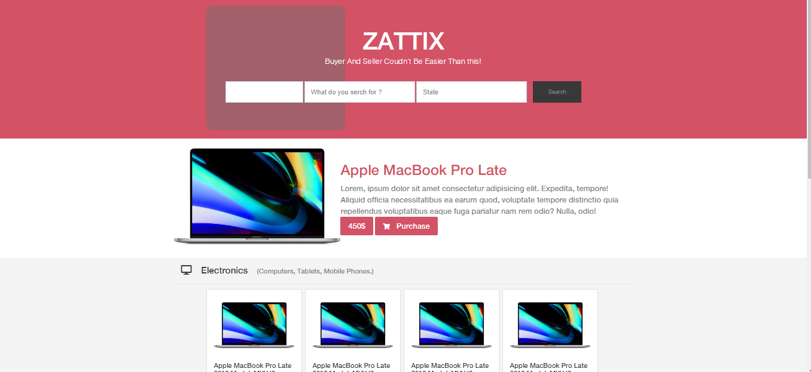
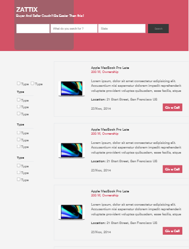
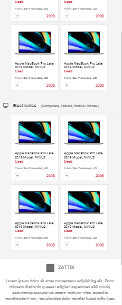
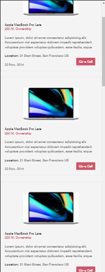

# HTML-CSS-capstone-project (based on an online shop for electronics)

> This is a project for the HTML & CSS capstone project: Online shop for electronics (https://www.behance.net/gallery/24796463/ZATTIX).
> The Project is based on an online shop for electronics.
> In this task I was required to create a responsive page using the best practices of HTML AND CSS with GitHub process flow.

## Desktop Screenshot

## Small screen Screenshot

## Built With

- Twitter’s Bootstrap framework
- HTML
- CSS
- SASS
- BIM
- 7-1 Pattern

## Requirements

- Use semantic HTML tags.
- Use CSS selectors correctly.
- Use HTML elements box model (margin, padding, width, height).
- Use industry-standard tools (flexbox) to place elements in the page.
- Ability to create UIs adaptable to different screen sizes using mediaqueries.
- Apply front-end best practices.

## Live Demo

[Live Demo Link home page](https://raw.githack.com/MohameDawood/ZATTIX/development-branch/index.html)

[Live Demo Link Search page](https://raw.githack.com/MohameDawood/ZATTIX/development-branch/Pages/search.html)

### Prerequisites

- Browser (Google Chrome, Mozilla Firefox, Safari or any other browser)

### Setup

- Download or clone the repository's files
- Open the index.html file using any web browser of your choice
- Additionally, You can go to [githack](https://raw.githack.com) and put the link of HTML file there and access the site from generated link.

## Author

👤 **Rocio Martinez**

- Github: [@MohameDawood](https://github.com/MohameDawood)
- Twitter: [@MohameDawood8](https://twitter.com/MohameDawood8)
- Linkedin: [MohameDawood](https://www.linkedin.com/in/MohameDawood/)

## 🤝 Contributing

Contributions, issues and feature requests are welcome!

Feel free to check the [issues page](https://github.com/MohameDawood/ZATTIX/issues).

## Show your support

Give a ⭐️ if you like this project!

## Acknowledgments

- Microverse
- GitHub
- Bootstrap
- SASS

## Thanks to

- [Mohammed Awad](https://www.behance.net/M_Awad) for the design guide.

## 📝 License

This project is [MIT](lic.url) licensed.
